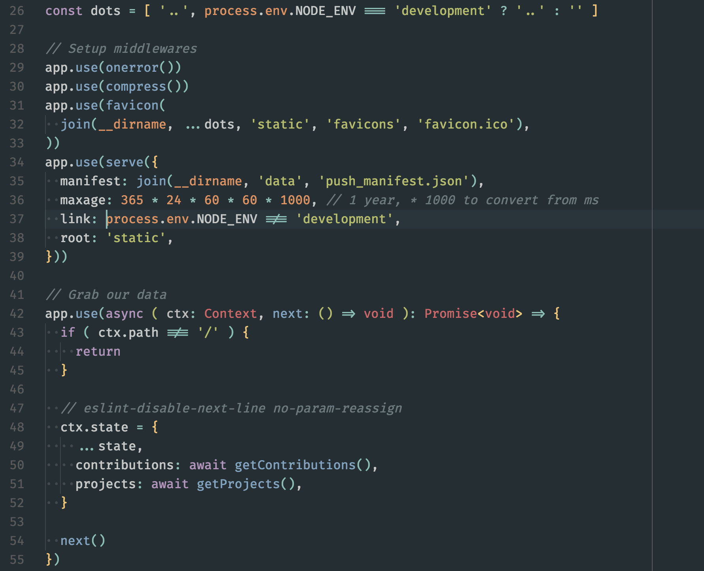
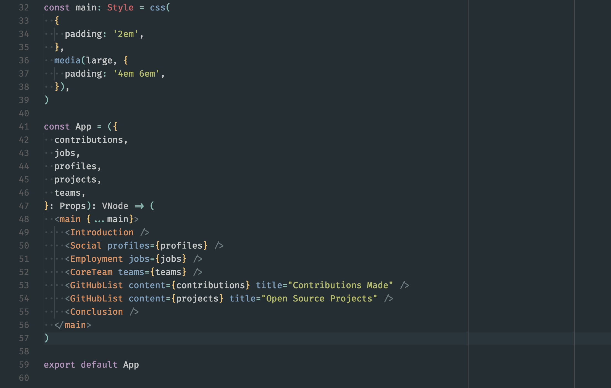
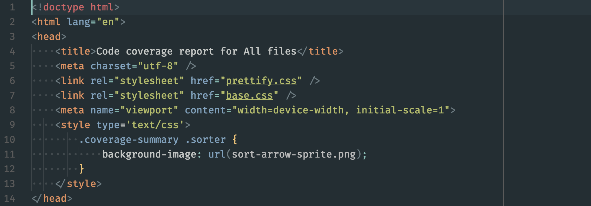
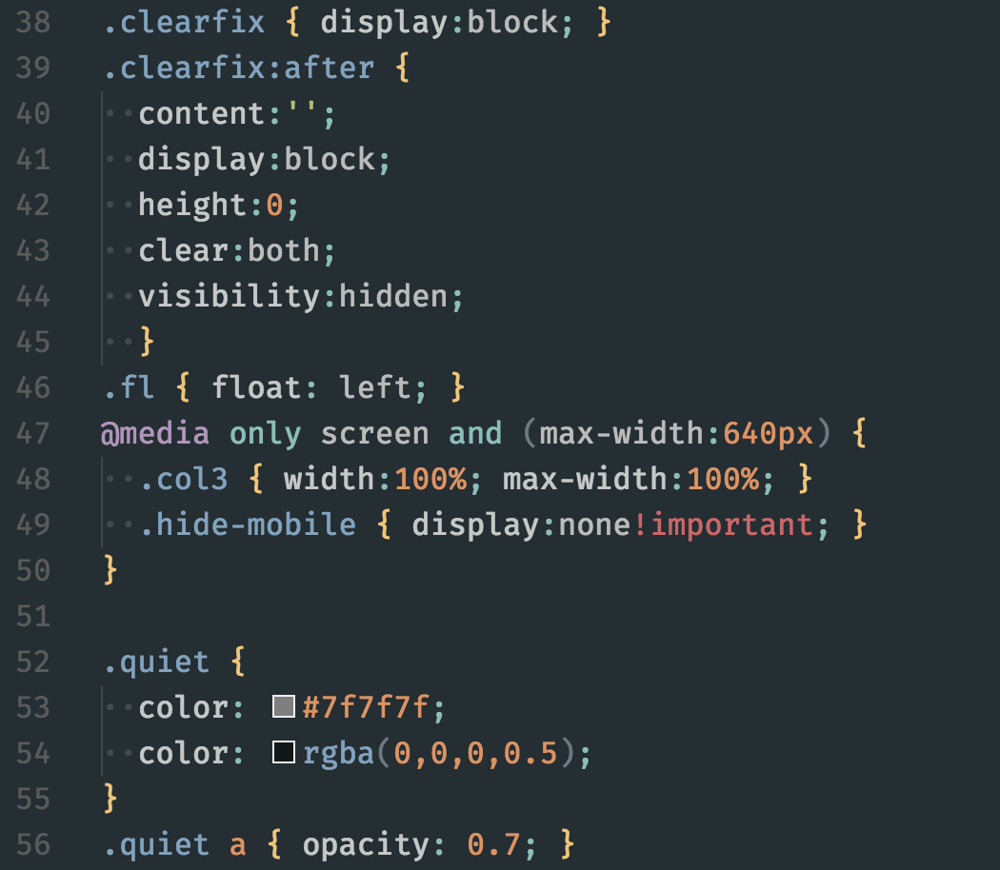

# Hybrid Next

[![Version][version-image]][marketplace-url]
[![Installs][installs-image]][marketplace-url]
[![Rating][rating-image]][marketplace-url]

> A port of the [Hybrid Next](https://github.com/kaicataldo/hybrid-next-syntax) theme to VS Code.

## Installation

### Extension Marketplace

Launch VS Code Quick Open (⌘+P), paste the following command, and press <kbd>enter</kbd>.

`ext install theme-hybrid-next`

### Download `.vsix` From Releases

Go to the [latest release](https://github.com/wyze/vscode-hybrid-next/releases/latest) and download the `.vsix` file.

Use the VS Code Command Palette (⇧⌘P) and run `Extensions: Install from VSIX...`.

### Clone Repository

Change to your VS Code extensions directory:

```sh
# Windows
$ cd %USERPROFILE%\.vscode\extensions

# Linux & macOS
$ cd ~/.vscode/extensions/
```

Clone this repository as `wyze.theme-hybrid-next`:

```sh
$ git clone https://github.com/wyze/vscode-hybrid-next.git wyze.theme-hybrid-next
```

## Screenshots

> Screenshots are using [Fira Code](https://github.com/tonsky/FiraCode) font.






## Change Log

> [Full Change Log](changelog.md)

### [v1.1.0](https://github.com/wyze/vscode-hybrid-next/releases/tag/v1.1.0) (2017-03-07)

* [[`8182af1c86`](https://github.com/wyze/vscode-hybrid-next/commit/8182af1c86)] - Add styling for XML (Neil Kistner)
* [[`1b4c316678`](https://github.com/wyze/vscode-hybrid-next/commit/1b4c316678)] - Add styling for markdown (Neil Kistner)

## Credits

Thank you to [Kai Cataldo](//github.com/kaicataldo) for making the Hybrid Next theme for Atom.

## License

MIT © [Neil Kistner](https://neilkistner.com)

[version-image]: http://vsmarketplacebadge.apphb.com/version/wyze.theme-hybrid-next.svg
[installs-image]: http://vsmarketplacebadge.apphb.com/installs/wyze.theme-hybrid-next.svg
[rating-image]: http://vsmarketplacebadge.apphb.com/rating-short/wyze.theme-hybrid-next.svg

[marketplace-url]: https://marketplace.visualstudio.com/items/wyze.theme-hybrid-next
